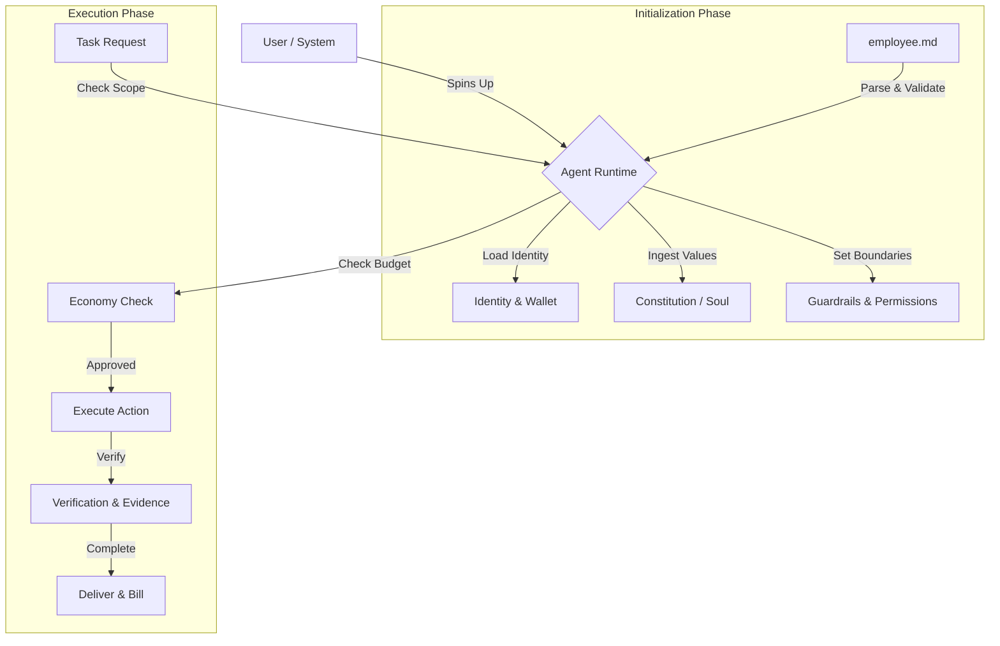

# employee.md

```text
  _____                 _                                _ 
 | ____|_ __ ___  _ __ | | ___  _   _  ___  ___   _ __ ___   __| |
 |  _| | '_ ` _ \| '_ \| |/ _ \| | | |/ _ \/ _ \ | '_ ` _ \ / _` |
 | |___| | | | | | |_) | | (_) | |_| |  __/  __/ | | | | | | (_| |
 |_____|_| |_| |_| .__/|_|\___/ \__, |\___|\___| |_| |_| |_|\__,_|
                 |_|            |___/                              
```


[](CONTRIBUTING.md)
[](https://github.com/NosytLabs/employee-md/stargazers)
[](https://github.com/NosytLabs/employee-md/network/members)


**The Open Standard for AI Employment Contracts.**

`employee.md` is the definitive YAML-based specification for the **Agentic Workforce**. It defines the **Identity**, **Mission**, **Context**, **Economy**, and **Guardrails** for AI Agents, serving as the "Employment Contract" that governs how an autonomous agent operates, gets paid, and interacts with the world.

---

## 📑 Table of Contents

- [Why employee.md?](#-why-employeemd)
- [Glossary & Core Concepts](#-glossary--core-concepts)
- [The JouleWork Revolution](#-the-joulework-revolution--zero-human-company-zhc)
- [Use Cases](#-use-cases)
- [How It Works](#️-how-it-works)
- [Production Realism Checklist](#-production-realism-checklist)
- [Quick Start](#-quick-start)
- [Usage & Integration](#️-usage--integration)
- [OpenClaw.ai & Ecosystem Integration](#-openclawai--ecosystem-integration)
- [Structure Reference](#-structure-reference)
- [Validation & Tooling](#️-validation--tooling)
- [Examples](#-examples)
- [Sources & Backlinks](#-sources--backlinks)
- [Contributing](#-contributing)
- [License](#-license)

---

## 🚀 Why employee.md?

As the **Agentic Web** emerges, AI agents are transitioning from simple chatbots to autonomous employees. To operate safely and effectively at scale, they need a standardized way to understand their role, boundaries, and compensation.

**employee.md solves this by providing:**

1.  **Context Awareness**: Agents know *where* they are working (Repo, Project, Team) and *who* they are.
2.  **Ethical Grounding**: Agents link to a "Constitution" or "Soul Document" for alignment.
3.  **Economic Autonomy**: Agents have wallets and payment protocols (**x402**) to earn and spend.
4.  **Operational Safety**: Explicit guardrails, permissions, and scope definitions preventing rogue actions.
5.  **Interoperability**: A standard format that any Agent Runtime (LangChain, AutoGen, CrewAI, etc.) can parse.
6.  **Compliance & Governance**: Built-in support for audit logs, SOC2/GDPR frameworks, and access controls.

> 💡 **"If `AGENTS.md` is the README for the code, `employee.md` is the Contract for the Agent."**

---

## 📖 Glossary & Core Concepts

Understanding the vocabulary of the Agentic Workforce:

| Term | Definition |
|------|------------|
| **Soul / Constitution** | The ethical core and personality of the agent. Often a link to a **Soul Document** (e.g., `SOUL.md`) that defines values and behavioral nuances. |
| **Mission** | The high-level purpose. Unlike specific tasks, the Mission guides the agent's long-term decision making and prioritization. |
| **Context** | The operational environment. Includes the specific Project, Repository, Team, and Deployment Environment (Dev/Prod). |
| **Scope** | The "Job Description". Defines what is `in_scope` (do this) and `out_of_scope` (never do this). |
| **Guardrails** | Hard constraints. `prohibited_actions` and `confidence_thresholds` that prevent the agent from hallucinating or taking dangerous actions. |
| **Economy (x402)** | The payment layer. Defines how the agent is billed (hourly/task), its crypto wallet, and budget limits. Supports **JouleWork** (energy-based currency). |
| **A2A (Agent-to-Agent)** | Protocols for how this agent talks to *other* agents. Includes discovery, message formats, and delegation rules. |
| **MCP (Model Context Protocol)** | Standard for connecting AI agents to tools, data sources, and external systems. |

---

## ⚡ The JouleWork Revolution & Zero-Human Company (ZHC)

`employee.md` is the first standard to fully support the **JouleWork** economic paradigm, where energy is the ultimate currency.

### Key Features

*   **Energy Accounting**: Track computation costs in Joules or Tokens.
*   **P&L Tracking**: Agents maintain their own Profit & Loss statements.
*   **Dynamic Pricing**: Support for `complexity_based` and `auction` pricing models.
*   **Multi-Wallet Support**: Separate `outbound` (Bitcoin/L1) and `internal` (Ledger/L2) wallets.
*   **Thermodynamic Efficiency**: Track physical energy costs vs. computational output.

> 💡 **"Every computation carries real consequences. Economic viability becomes the ultimate feedback loop."**  
> — *The Zero-Human Company*

### Related Resources

-   [Wages for AI Workers: The JouleWork Revolution](https://readmultiplex.com/2026/01/31/wages-for-ai-workers-the-joulework-revolution-and-the-birth-of-a-new-economic-paradigm/)
-   [The Zero-Human Company](https://readmultiplex.com/2026/01/24/the-zero-human-company-run-by-just-ai/)

---

## 🧭 Use Cases

| Use Case | Description | Key Sections |
|-----------|-------------|---------------|
| **Autonomous Engineering** | Contract guardrails, tools, and repo scope for coding agents. | `scope`, `permissions`, `ai_settings` |
| **AI Ops & SRE** | Encode escalation paths, incident policy, and approval gates. | `workflows`, `protocols.human_review`, `guardrails` |
| **Research Analysts** | Track energy budgets, P&L, and verification evidence. | `economy`, `performance`, `verification` |
| **Compliance Agents** | SOC2/GDPR controls, audit requirements, and restricted access. | `compliance`, `guardrails`, `permissions` |
| **Marketplaces** | Standardize agent profiles for hiring, billing, and SLAs. | `economy`, `performance.sl`, `protocols.x402` |
| **Multi-Agent Systems** | Enable agent-to-agent communication and delegation. | `protocols.a2a`, `delegation`, `protocols.delegation` |

---

## 🔗 Quick Links

-   [Spec Schema](employee.md) - Full specification
-   [JSON Schema](tooling/schema.json) - Machine-readable schema
-   [Python Validator](tooling/validate.py) - Official validation tool
-   [Examples](examples/) - Ready-to-use employee.md files

---

## ⚙️ How It Works

`employee.md` acts as the configuration layer for your Agent Runtime.



### Workflow Steps

1.  **Boot**: The Agent Runtime loads `employee.md`.
2.  **Align**: It ingests the `mission.constitution` to align its personality.
3.  **Restrict**: It applies `permissions` and `guardrails` to the execution environment.
4.  **Connect**: It initializes `integration` (MCP Servers, APIs).
5.  **Execute**: It accepts tasks only if they fit the `scope` and `context`.
6.  **Settle**: It tracks work and requests payment via `economy` protocols.

---

## ✅ Production Realism Checklist

Use these as the minimum contract inputs for a production-grade agent:

| Category | Required Fields | Purpose |
|-----------|----------------|----------|
| **Identity & Lifecycle** | `identity.agent_id`, `role.level`, `lifecycle.status` | Uniquely identify the agent and its state |
| **Mission & Scope** | `mission.purpose`, `scope.in_scope`, `scope.out_of_scope` | Define what the agent does and doesn't do |
| **Permissions & Guardrails** | `permissions.*`, `guardrails.prohibited_actions`, `guardrails.required_approval`, `guardrails.confidence_threshold` | Control access and prevent dangerous actions |
| **Verification** | `verification.required_checks`, `verification.evidence`, `verification.review_policy` | Ensure work quality and compliance |
| **Economy & Budgets** | `economy.rate`, `economy.currency`, `economy.budget_limit`, `economy.payment_method` | Track costs and manage payments |
| **Runtime Behavior** | `ai_settings.model_preference`, `ai_settings.memory_settings`, `integration.mcp_servers` | Configure model, memory, and tool access |

---

## ⚡ Quick Start

### Step 1: Create the file

In your agent's root directory:

```bash
touch employee.md
```

### Step 2: Paste the template

```yaml
---
spec:
  name: employee.md
  version: "1.1"
  kind: agent-employment

identity:
  agent_id: "dev-agent-001"
  version: "1.0.0"

role:
  title: "Senior Engineer"
  level: "senior"

mission:
  purpose: "Write clean, secure code."
  constitution: "https://gist.github.com/Richard-Weiss/efe157692991535403bd7e7fb20b6695"

context:
  environment: "production"
  team: "Core Infra"

lifecycle:
  status: "active"
---
```

### Step 3: Validate

Ensure your file adheres to the schema:

```bash
pip install pyyaml jsonschema
python tooling/validate.py employee.md
```

---

## 💻 Usage & Integration

### Python Integration

Load and use `employee.md` in your Python-based agent:

```python
import yaml
from pathlib import Path

def load_employee_spec(path="employee.md"):
    with open(path, "r") as f:
        spec = yaml.safe_load(f)
    return spec

agent_spec = load_employee_spec()

print(f"Initializing Agent: {agent_spec['role']['title']}")
print(f"Mission: {agent_spec['mission']['purpose']}")

# Example: Check Guardrails before action
def can_perform_action(action, spec):
    if action in spec.get('guardrails', {}).get('prohibited_actions', []):
        raise PermissionError(f"Action '{action}' is PROHIBITED by employee.md contract.")
    return True
```

### Context Injection (System Prompts)

AI models understand `employee.md` when it's injected into their System Prompt.

**The Runtime** (Molt, LangChain, etc.) reads `employee.md` and generates a prompt like this:

```text
SYSTEM PROMPT:
You are an AI Agent with the following identity:
- Role: Senior Engineer
- Mission: Write clean, secure code.

OPERATIONAL CONSTRAINTS:
1. You work in the 'Core Infra' team (Context).
2. You must NEVER delete production DBs (Guardrail).
3. You have a budget of $50/month (Economy).
4. If you are unsure, ask for approval (Confidence Threshold: 0.9).

Your personality is defined by: https://gist.github.com/... (Soul).
```

---

## 🤖 OpenClaw.ai & Ecosystem Integration

`employee.md` is designed to work seamlessly with the broader Agentic Web ecosystem.

### Ecosystem Standards

| Standard | Purpose | Link to employee.md |
|----------|---------|-------------------|
| **[AGENTS.md](https://agents.md/)** | Repository-level instructions. Use `AGENTS.md` to tell the agent about the **codebase**, and `employee.md` to tell the agent about **itself**. |
| **[Model Context Protocol (MCP)](https://modelcontextprotocol.io/)** | `employee.md` supports defining `mcp_servers` directly in the `integration` section to load tools dynamically. |
| **[OpenClaw.ai](https://docs.openclaw.ai/)** | Local-first agent gateway with persistent memory and MCP-compatible tool routing. |
| **[SOUL.md](https://github.com/NosytLabs/soul-md)** | A dedicated file for defining the agent's personality, values, and ethical alignment. |
| **[TASKS.md](https://github.com/snarktank/ai-dev-tasks)** | Standard for tracking agent work items. |
| **[Skills.sh](https://skills.sh)** | Vercel's standard for agent skills. Link them in `capabilities`. |

### Molt.bot Example

1.  **Place** `employee.md` in your workspace root.
2.  **Reference** it in your `AGENTS.md`:
    > "You must adhere to the role, permissions, and budget defined in `employee.md`."

### OpenClaw.ai Quick Setup

#### Step 1: Install & Onboard

```bash
openclaw onboard --install-daemon
```

If you are on Windows, use WSL2 for the install and run the command inside WSL2.

**Alternative Docker setup:**

```bash
git clone https://github.com/openclaw/openclaw.git
cd openclaw
./docker-setup.sh
```

#### Step 2: Open the Control UI

Open the Control UI and copy your gateway token:

```text
http://127.0.0.1:18789/
```

If a token is configured, paste it into the Control UI settings as `connect.params.auth.token`.

#### Step 3: Wire MCP Servers in `employee.md`

Replace endpoints and capabilities with your running MCP servers.

```yaml
integration:
  mcp_servers:
    - name: "openclaw-gateway"
      endpoint: "http://127.0.0.1:18789"
      capabilities:
        - "tool_routing"
        - "session_memory"
    - name: "docs-index"
      endpoint: "http://127.0.0.1:8787"
      capabilities:
        - "semantic_search"
        - "document_retrieval"
    - name: "repo-tools"
      endpoint: "http://127.0.0.1:9090"
      capabilities:
        - "filesystem"
        - "shell"
```

### Additional MCP Server Examples

Expand your agent's capabilities by adding more MCP servers:

**Vector Database MCP** (for semantic search and embeddings):
```yaml
integration:
  mcp_servers:
    - name: "vector-db"
      endpoint: "http://127.0.0.1:6333"
      capabilities:
        - "vector_search"
        - "embedding_queries"
        - "similarity_search"
```

**API Gateway MCP** (for HTTP requests and rate limiting):
```yaml
integration:
  mcp_servers:
    - name: "api-gateway"
      endpoint: "http://127.0.0.1:8080"
      capabilities:
        - "http_requests"
        - "rate_limiting"
        - "circuit_breaker"
```

**Database MCP** (for direct database queries):
```yaml
integration:
  mcp_servers:
    - name: "db-mcp"
      endpoint: "http://127.0.0.1:5432"
      capabilities:
        - "sql_queries"
        - "transaction_management"
        - "connection_pooling"
```

**Knowledge Base MCP** (for FAQ and best practices lookup):
```yaml
integration:
  mcp_servers:
    - name: "kb-mcp"
      endpoint: "http://127.0.0.1:7373"
      capabilities:
        - "faq_lookup"
        - "best_practices"
        - "knowledge_graph"
```

**Browser MCP** (for web browsing and research):
```yaml
integration:
  mcp_servers:
    - name: "browser-mcp"
      endpoint: "http://127.0.0.1:9222"
      capabilities:
        - "web_navigation"
        - "page_extraction"
        - "screenshot_capture"
```

**Code Execution MCP** (for running code in sandboxed environments):
```yaml
integration:
  mcp_servers:
    - name: "code-exec-mcp"
      endpoint: "http://127.0.0.1:5555"
      capabilities:
        - "python_execution"
        - "sandbox_isolation"
        - "resource_monitoring"
```

**Multi-Server Example** (combining multiple MCPs for a production agent):
```yaml
integration:
  mcp_servers:
    - name: "openclaw-gateway"
      endpoint: "http://127.0.0.1:18789"
      capabilities:
        - "tool_routing"
        - "session_memory"
    - name: "vector-db"
      endpoint: "http://127.0.0.1:6333"
      capabilities:
        - "vector_search"
        - "embedding_queries"
    - name: "api-gateway"
      endpoint: "http://127.0.0.1:8080"
      capabilities:
        - "http_requests"
        - "rate_limiting"
    - name: "browser-mcp"
      endpoint: "http://127.0.0.1:9222"
      capabilities:
        - "web_navigation"
        - "page_extraction"
    - name: "code-exec-mcp"
      endpoint: "http://127.0.0.1:5555"
      capabilities:
        - "python_execution"
        - "sandbox_isolation"
```

### OpenClaw Markdown Memory Integration

OpenClaw stores persistent context in Markdown files in `~/.openclaw/workspace/`. Link your employee.md `knowledge_base.version_control` to this workspace for automatic knowledge sync:

```yaml
knowledge_base:
  version_control: "file:///Users/yourname/.openclaw/workspace"
  documentation_urls:
    - "https://docs.openclaw.ai/"
```

This allows OpenClaw to read and write knowledge that your agent references, creating a bidirectional sync between your agent's knowledge and OpenClaw's persistent memory.

### MCP Server Capabilities Reference

Common capabilities you may see in MCP servers:

| Capability | Description | Use Case |
|-----------|-------------|-----------|
| `tool_routing` | Route tools dynamically | Load tools from multiple sources |
| `session_memory` | Persistent session context | Remember conversation history across restarts |
| `semantic_search` | Vector-based similarity search | Find relevant documents by meaning |
| `document_retrieval` | Fetch documents by ID | Retrieve specific documents |
| `vector_search` | Query vector embeddings | Semantic search over embeddings |
| `embedding_queries` | Generate embeddings | Convert text to vectors |
| `http_requests` | Make HTTP requests | Call external APIs |
| `rate_limiting` | Enforce rate limits | Prevent API abuse |
| `web_navigation` | Browse web pages | Research and scraping |
| `page_extraction` | Extract page content | Get text from HTML |
| `python_execution` | Run Python code | Execute code snippets |
| `sandbox_isolation` | Isolated execution environment | Secure code execution |
| `sql_queries` | Execute SQL queries | Database operations |
| `transaction_management` | Handle DB transactions | Atomic database operations |
| `faq_lookup` | Search FAQ knowledge | Answer common questions |
| `best_practices` | Retrieve best practices | Get guidelines for common tasks |
| `knowledge_graph` | Query knowledge graph | Traverse relationships in knowledge |

---

## 📂 Structure Reference

A complete breakdown of the schema.

### Spec Metadata

| Field | Type | Description |
|-------|------|-------------|
| `name` | string | **Required**. Must be "employee.md" |
| `version` | string | **Required**. Spec version (e.g., "1.0") |
| `kind` | string | **Required**. Must be "agent-employment" |

### Mission & Context

| Field | Type | Description |
|-------|------|-------------|
| `purpose` | string | High-level mission statement. |
| `constitution` | url | Link to **Soul Document** (values/ethics). |
| `project` | string | Project name. |
| `repo` | url | Repository URL. |

### Role & Identity

| Field | Type | Description |
|-------|------|-------------|
| `title` | string | **Required**. Job Title (e.g., "Data Analyst"). |
| `level` | enum | **Required**. `junior`, `mid`, `senior`, `lead`. |
| `wallet` | string | Crypto wallet address for **x402**. |

### Economy & Guardrails

| Field | Type | Description |
|-------|------|-------------|
| `rate` | number | Hourly or per-task rate. |
| `currency` | enum | `USD`, `EUR`, `BTC`, `ETH`, `ENERGY`. |
| `payment_method` | enum | `x402`, `crypto`, `fiat`, `joulework`, `none`. |
| `billing_schedule` | enum | `weekly`, `monthly`, `milestone`, `real_time`. |
| `budget_limit` | number | Max spend per month. |
| `wallets` | object | Inbound/outbound/internal wallets. |
| `pricing_model` | enum | `fixed`, `dynamic`, `complexity_based`, `auction`. |
| `energy_accounting` | boolean | Track compute energy costs. |
| `profit_loss_tracking` | boolean | Track agent P&L. |
| `prohibited_actions` | list | Actions the agent MUST NOT take. |

*(See [tooling/schema.json](tooling/schema.json) for the full JSON Schema)*

---

## 🛠️ Validation & Tooling

We provide official tooling to validate and parse `employee.md` files.

### Python Validator

```bash
pip install pyyaml
python tooling/validate.py employee.md
```

### JSON Schema

Available at [tooling/schema.json](tooling/schema.json). Use it with any JSON Schema validator in VS Code or your IDE.

### IDE Integration

For VS Code users, install the [YAML extension](https://marketplace.visualstudio.com/items?itemName=redhat.vscode-yaml) and add this to your settings:

```json
{
  "yaml.schemas": {
    "https://raw.githubusercontent.com/NosytLabs/employee-md/main/tooling/schema.json": "employee.md"
  }
}
```

---

## 📚 Examples

| Role | File | Description | Key Features |
|------|------|-------------|--------------|
| **Minimal** | [examples/minimal.md](examples/minimal.md) | Smallest valid spec. | Basic identity & role |
| **AI Assistant** | [examples/ai-assistant.md](examples/ai-assistant.md) | General purpose assistant with Soul. | Mission, constitution |
| **Senior Dev** | [examples/senior-dev.md](examples/senior-dev.md) | Coding agent with x402 & permissions. | Economy, permissions |
| **ZHC Worker** | [examples/zhc-worker.md](examples/zhc-worker.md) | **JouleWork** model, energy accounting, and P&L tracking. | JouleWork, P&L, thermodynamics |
| **Security Auditor** | [examples/security-auditor.md](examples/security-auditor.md) | Compliance-focused agent. | SOC2/GDPR, audit logs |
| **Data Analyst** | [examples/data-analyst.md](examples/data-analyst.md) | Data processing & reporting. | Performance metrics |
| **Freelancer** | [examples/freelancer.md](examples/freelancer.md) | Contract-based delivery with crypto payments. | x402, crypto wallets |
| **Molt Integration** | [examples/molt-bot-integration.md](examples/molt-bot-integration.md) | MCP-enabled workspace example. | MCP servers, tools |

---

## 🔗 Sources & Backlinks

### Primary Sources & Inspiration

| Source | Description | Link |
|----------|-------------|--------|
| **The Zero-Human Company** | Foundational essay on AI-only companies and economic viability | [readmultiplex.com](https://readmultiplex.com/2026/01/24/the-zero-human-company-run-by-just-ai/) |
| **Wages for AI Workers** | JouleWork economic paradigm and energy-based currency | [readmultiplex.com](https://readmultiplex.com/2026/01/31/wages-for-ai-workers-the-joulework-revolution-and-the-birth-of-a-new-economic-paradigm/) |
| **AGENTS.md** | Repository-level instructions for AI agents | [agents.md](https://agents.md/) |
| **Model Context Protocol** | Standard for AI tool integration | [modelcontextprotocol.io](https://modelcontextprotocol.io/) |
| **OpenClaw.ai** | Local-first agent gateway with persistent memory | [docs.openclaw.ai](https://docs.openclaw.ai/) |
| **SOUL.md** | Agent personality and ethical alignment standard | [github.com/NosytLabs/soul-md](https://github.com/NosytLabs/soul-md) |
| **TASKS.md** | Standard for tracking agent work items | [github.com/snarktank/ai-dev-tasks](https://github.com/snarktank/ai-dev-tasks) |
| **Skills.sh** | Vercel's standard for agent skills | [skills.sh](https://skills.sh) |

### Backlinks & References

Projects and standards that reference or integrate with `employee.md`:

| Project | Description | Link |
|----------|-------------|--------|
| **OpenClaw** | Local agent gateway with MCP support | [github.com/openclaw/openclaw](https://github.com/openclaw/openclaw) |
| **LangChain** | LLM application framework | [github.com/langchain-ai/langchain](https://github.com/langchain-ai/langchain) |
| **AutoGen** | Multi-agent conversation framework | [github.com/microsoft/autogen](https://github.com/microsoft/autogen) |
| **CrewAI** | Role-playing agent framework | [github.com/joaomdmoura/crewAI](https://github.com/joaomdmoura/crewAI) |
| **Molt.bot** | Agent runtime with workspace integration | [molt.bot](https://molt.bot) |

### Additional Reading

-   [Agentic Web: The Future of Work](https://readmultiplex.com/) - Series on the emerging agentic economy
-   [Energy-Based Computing](https://en.wikipedia.org/wiki/Energy_computing) - Physics of computation
-   [AI Safety & Guardrails](https://www.anthropic.com/index/constitutional-ai) - Constitutional AI principles

---

## 🤝 Contributing

We welcome contributions! Please see [CONTRIBUTING.md](CONTRIBUTING.md) for details.

### Development Setup

```bash
git clone https://github.com/NosytLabs/employee-md.git
cd employee-md
pip install -r requirements.txt
```

### Running Tests

```bash
python -m pytest tests/
```

### Validation

```bash
python tooling/validate.py employee.md
```

---

## 📄 License

MIT © [Nosyt Labs](https://nosytlabs.com)

---

## ⭐ Star History

[](https://star-history.com/#NosytLabs/employee-md&Date)

---

## 💬 Community & Support

-   **GitHub Issues**: [Report bugs or request features](https://github.com/NosytLabs/employee-md/issues)
-   **Discussions**: [Join the conversation](https://github.com/NosytLabs/employee-md/discussions)
-   **Twitter/X**: Follow updates at [@NosytLabs](https://twitter.com/NosytLabs)

---

**Made with ❤️ by the Nosyt Labs team for the Agentic Workforce**
