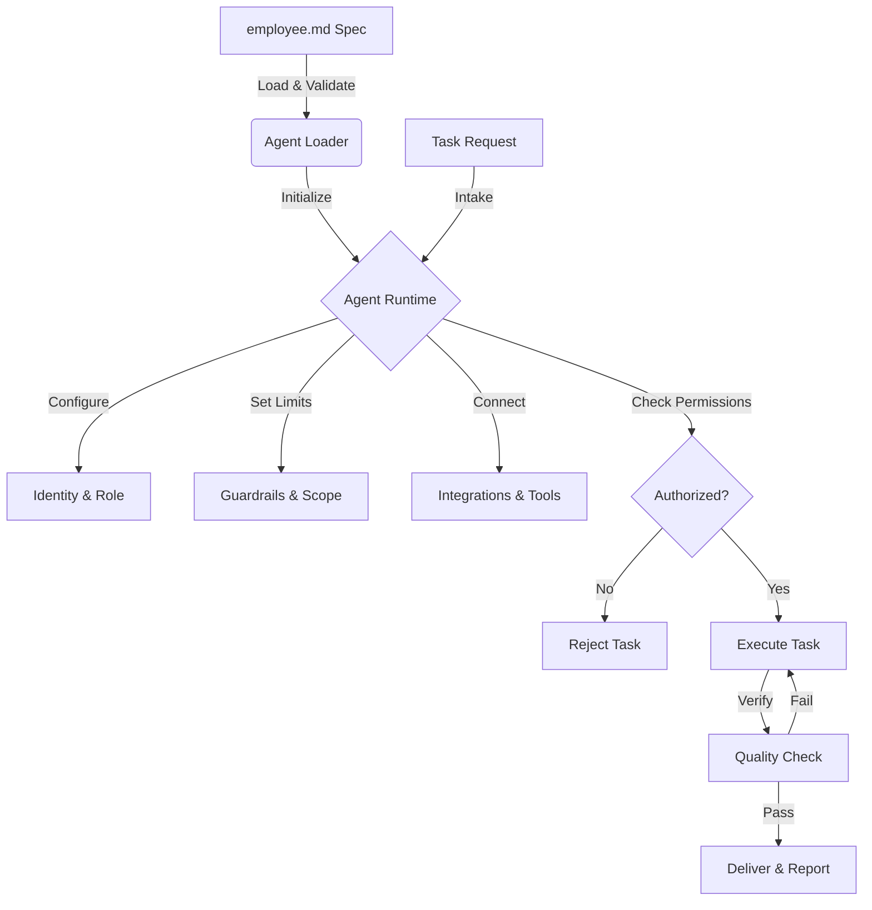

# employee.md


[](CONTRIBUTING.md)

**AI agent employment specification.**

---

## Quick Start

```yaml
---
spec:
  name: "employee.md"
  version: "1.0"
  kind: "agent-employment"
  status: "stable"
  schema: "https://raw.githubusercontent.com/NosytLabs/employee-md/main/tooling/schema.json"
  license: "MIT"
  homepage: "https://github.com/NosytLabs/employee-md"

role:
  title: "Worker"
  level: "senior"

lifecycle:
  status: "active"
---
```

---

## What is employee.md?

**employee.md** = Open YAML specification for AI agent employment.

AI agents read this file to understand:
- **Who they are** (identity, role, level)
- **Why they exist** (mission, objectives, success criteria)
- **What they can do** (capabilities, skills)
- **What is in or out of scope** (scope, constraints)
- **How to get paid** (rate, payment method, budget)
- **What access they have** (permissions)
- **Rules to follow** (delegation limits, guardrails)
- **Their status** (active, suspended, terminated)
- **AI settings** (model preference, token limits, tools)
- **Knowledge base** (documentation, training data)
- **Integrations** (APIs, webhooks, services)
- **Performance metrics** (KPIs, SLAs, benchmarks)
- **Protocols** (A2A, x402, human review)
- **Quality expectations** (verification and evidence)

---

## How It Works



- Load the YAML at startup and treat it as the agent’s employment contract
- Enforce guardrails and operating policy before executing tasks
- Use mission and scope to accept or decline requests
- Check permissions and lifecycle status before performing actions
- Apply role, delegation, and lifecycle limits when planning or delegating work
- Use AI settings and knowledge base pointers to select tools and context
- Track outputs and performance metrics for audits and reviews
- Run verification checks and attach evidence to required outputs

---

## How to Use

1. Create an employee.md in your project or agent workspace
2. Fill required fields: role.title, role.level, lifecycle.status
3. Define mission, scope, and permissions so the agent can self-filter tasks
4. Add operating policy, guardrails, and workflows to match your org rules
5. Add verification requirements and expected evidence
6. Load and validate the file at startup
7. Enforce it in task planning and execution


## Use Cases


- Standardize AI agent roles across teams and vendors
- Automate onboarding with consistent operational constraints
- Enforce compliance and audit readiness for sensitive workflows
- Drive multi-agent coordination with delegation and A2A protocols
- Tie compensation, budgets, and payment rails to agent work
- Track KPIs, SLAs, and benchmarks across deployed agents

---

## Compatibility

employee.md complements other agent standards like AGENTS.md or skills.md by focusing on employment constraints, scope, and economics. Use AGENTS.md for repository-level instructions and employee.md for the agent’s contract.

---

## Related Standards

- AGENTS.md is a repository-level instruction file for coding agents: https://agents.md/
- skills.md captures skill inventories and proficiency levels for agents or teams
- worker.md is commonly used to describe runtime limits and execution constraints in some stacks
- employee.md is an employment contract for agent behavior, constraints, and economics

---

## Related Reading

- Claude 4.5 Opus Soul Document: https://gist.github.com/Richard-Weiss/efe157692991535403bd7e7fb20b6695


## Schema


JSON Schema: https://raw.githubusercontent.com/NosytLabs/employee-md/main/tooling/schema.json

---

## Structure

### Spec
Specification metadata:
- `name` - Spec name
- `version` - Spec version
- `kind` - Spec kind
- `status` - draft | stable | deprecated
- `schema` - URL to JSON Schema
- `license` - SPDX license identifier
- `homepage` - Spec homepage URL
- `namespace` - Spec namespace or organization
- `compatibility` - Compatible standards
- `supersedes` - Superseded standards
- `extends` - Extended standards

### Identity
Agent identification and metadata:
- `agent_id` - Unique identifier (required)
- `version` - Config version
- `wallet` - Crypto wallet address
- `created_at` - ISO date

### Role
Job definition and skills:
- `title` - Job title (required)
- `level` - junior | mid | senior | lead (required)
- `department` - Team/department
- `capabilities` - List of skills
- `skills` - Detailed skills with levels
- `work_location` - remote | office | hybrid
- `employment_type` - full_time | part_time | contract

### Mission
Purpose and objectives:
- `purpose` - Primary mission statement
- `objectives` - Key goals
- `success_criteria` - Measurable outcomes
- `non_goals` - Explicit exclusions

### Scope
Task boundaries:
- `in_scope` - Work the agent should accept
- `out_of_scope` - Work the agent must decline
- `dependencies` - Required systems or approvals
- `constraints` - Hard limitations (time, budget, policy)

### Permissions
Access boundaries:
- `data_access` - Allowed data classifications or sources
- `system_access` - Systems or environments allowed
- `network_access` - Network destinations or restrictions
- `tool_access` - Approved tools and services

### Verification
Quality gates:
- `required_checks` - Lint, tests, security checks
- `evidence` - Artifacts required for completion
- `review_policy` - Review routing rules

### Principles
- `principles` - Values and priorities that guide decisions

### Operating Policy
- `always` - Actions the agent must always do
- `avoid` - Actions the agent must avoid
- `ask_first` - Actions requiring explicit approval
- `evidence_required` - Proof or artifacts required before completion

### Workflows
- `intake` - Steps for accepting and scoping tasks
- `execution` - Steps for delivering work
- `review` - Steps for quality checks
- `handoff` - Steps for reporting and transfer

### Outputs
- `deliverables` - Required outputs (files, diffs, reports)
- `artifacts` - Evidence or logs to attach
- `reporting` - Status updates or summaries expected

### Economy
Payment and billing:
- `rate` - Hourly/project rate
- `currency` - USD | EUR | BTC | ETH (default: USD)
- `payment_method` - x402 | crypto | fiat | none
- `billing_schedule` - weekly | monthly | milestone
- `budget_limit` - Monthly spend limit
- `cost_center` - Department code

### Delegation
Task management:
- `max_tasks` - Concurrent task limit (default: 5)
- `protocol` - A2A | human_review | auto (default: auto)
- `task_timeout` - Seconds before timeout (default: 3600)
- `sub_delegation` - Allow delegating to other agents (default: false)
- `escalation_path` - List of agent IDs to escalate to

### Lifecycle
Employment status:
- `status` - onboarding | active | suspended | terminated (required)
- `start_date` - ISO date
- `end_date` - ISO date
- `probation_end` - ISO date
- `performance_rating` - exceeds | meets | needs_improvement
- `next_review` - ISO date

### Compliance
Regulatory requirements:
- `frameworks` - SOC2, GDPR, HIPAA, etc.
- `data_classification` - public | confidential | restricted
- `audit_required` - Enable logging for compliance (default: false)
- `security_clearance` - none | basic | secret | top_secret (default: none)

### Communication
Contact preferences:
- `channels` - Slack, Email, Discord, etc.
- `timezone` - IANA timezone (default: UTC)
- `availability` - 9:00-18:00 UTC or "24/7"
- `response_time` - Expected response time

### Guardrails
Safety constraints:
- `prohibited_actions` - Actions agent must never take
- `required_approval` - Actions requiring human approval
- `max_spend_per_task` - Per-task spending limit
- `confidence_threshold` - Min confidence to act (0.0-1.0, optional)

### AI Settings
AI model configuration:
- `model_preference` - gpt-4, claude-3, llama-3, etc.
- `token_limits` - Input, output, context window sizes
- `generation_params` - Temperature, top_p, penalties
- `tools_enabled` - function_calling, code_execution, web_browsing
- `memory_settings` - Context retention, history, vector store
- `reasoning_effort` - low | medium | high

### Knowledge Base
Documentation and training:
- `documentation_urls` - Internal documentation URLs
- `training_data` - Sources, corpora, datasets
- `faq_links` - FAQ or help documentation
- `best_practices` - Best practice guidelines
- `version_control` - VCS URL for knowledge sync

### Integration
External system connections:
- `apis` - External API integrations
- `webhooks` - Webhook endpoints for events
- `services` - Connected services (database, storage, queue, cache)
- `mcp_servers` - MCP server connections

### Performance
Metrics and monitoring:
- `metrics` - Performance metrics to track
- `kpis` - Key Performance Indicators
- `slas` - Service Level Agreements
- `benchmarks` - Test benchmarks

### Protocols
Communication and payment standards:
- `a2a` - Agent-to-agent communication
- `x402` - Payment protocol
- `human_review` - Human review workflow
- `delegation` - Task delegation protocol

### Custom Fields
- `custom_fields` - Any additional data (optional)

---

## Examples

### Minimal

**File:** [examples/minimal.md](examples/minimal.md)

```yaml
---
spec:
  name: "employee.md"
  version: "1.0"
  kind: "agent-employment"
  status: "stable"
  schema: "https://raw.githubusercontent.com/NosytLabs/employee-md/main/tooling/schema.json"
  license: "MIT"
  homepage: "https://github.com/NosytLabs/employee-md"

role:
  title: "Worker"
  level: "senior"

lifecycle:
  status: "active"
---
```

### AI Assistant

**File:** [examples/ai-assistant.md](examples/ai-assistant.md)

Full-featured AI assistant with:
- AI settings (model, tokens, tools, memory)
- Knowledge base (documentation, training data)
- Integration (APIs, webhooks, services, MCP)
- Performance metrics, KPIs, SLAs
- Protocols (A2A, human review, delegation)
- Guardrails

### Data Analyst

**File:** [examples/data-analyst.md](examples/data-analyst.md)

Data analyst configuration with:
- AI settings for data processing
- Knowledge base with data sources
- Integration with Snowflake and S3
- Performance metrics for accuracy and speed

### Security Auditor

**File:** [examples/security-auditor.md](examples/security-auditor.md)

Security auditor configuration with:
- Compliance frameworks (SOC2, GDPR, HIPAA, PCI-DSS)
- Security clearance
- AI settings for security scanning
- Integration with security tools
- x402 payment protocol
- Performance benchmarks

### Senior Developer

**File:** [examples/senior-dev.md](examples/senior-dev.md)

Full-featured senior developer with:
- Identity and wallet
- Capabilities and skills
- Economy with x402 payments
- Delegation with escalation
- Compliance frameworks
- Communication channels
- Guardrails

### Freelancer

**File:** [examples/freelancer.md](examples/freelancer.md)

Freelancer configuration with:
- Contract employment
- Crypto payments
- Flexible availability
- Limited delegation

---

## How AI Uses This

### Step 1: Parse YAML
AI reads the YAML file and extracts all fields.

### Step 2: Understand Identity
AI knows who they are (`agent_id`, `version`).

### Step 3: Understand Role
AI knows their job title, level, capabilities, and skills.

### Step 4: Understand Economy
AI knows their rate, payment method, and budget limits.

### Step 5: Understand Delegation
AI knows task limits, protocol, and escalation rules.

### Step 6: Understand Lifecycle
AI knows their current status and key dates.

### Step 7: Follow Guardrails
AI respects prohibited actions, approval requirements, and confidence thresholds.

### Step 8: Configure AI
AI uses AI settings for model preference, token limits, generation params, tools, memory.

### Step 9: Access Knowledge Base
AI uses knowledge base for documentation, training data, FAQs, best practices.

### Step 10: Use Integrations
AI connects to APIs, webhooks, services, MCP servers.

### Step 11: Track Performance
AI monitors metrics, KPIs, SLAs, benchmarks.

### Step 12: Use Protocols
AI communicates via A2A, handles x402 payments, follows human review, delegates tasks.

### Step 13: Communicate
AI uses specified channels, timezone, and availability.

---

## Validation

### Using Python Validator

```bash
# Install dependencies
pip install pyyaml

# Run validation
python tooling/validate.py employee.md

# Validate examples
python tooling/validate.py examples/ai-assistant.md
python tooling/validate.py examples/data-analyst.md
python tooling/validate.py examples/security-auditor.md
```

### Using JSON Schema

```python
import json
from jsonschema import validate, ValidationError
import yaml

with open('tooling/schema.json', 'r') as f:
    schema = json.load(f)

with open('employee.md', 'r') as f:
    config = yaml.safe_load(f)

try:
    validate(instance=config, schema=schema)
    print("✓ Valid!")
except ValidationError as e:
    print(f"✗ Invalid: {e.message}")
```

---

## Integration

See [INTEGRATION.md](INTEGRATION.md) for complete integration guides:

- Python integration (PyYAML, Pydantic)
- TypeScript integration (js-yaml, Zod)
- LangChain integration
- AutoGen integration
- Protocol integration (A2A, x402)
- MCP server integration
- Error handling
- Best practices

---

## Best Practices

### For AI Parsing
- **Use inline comments** - Every field has a comment explaining type/options
- **Use enums in comments** - e.g., "junior | mid | senior | lead"
- **Specify defaults** - e.g., "(default: UTC)"
- **Group related fields** - identity, role, economy, delegation, etc.

### For AI Behavior
- **Set clear delegation limits** - Prevent task overload
- **Define guardrails** - Safety boundaries for AI actions
- **Specify protocols** - How AI should handle tasks (auto vs human review)
- **Set confidence thresholds** - When to act vs ask for help
- **Configure AI settings** - Model preference, token limits, tools
- **Define knowledge base** - Documentation, training data, FAQs
- **Track performance** - Metrics, KPIs, SLAs, benchmarks

### For Humans
- **Use semantic versioning** - "1.0", "1.1", etc.
- **Use ISO dates** - "2025-01-28" for consistency
- **Use standard currencies** - USD, EUR, BTC, ETH
- **Document custom fields** - Add comments explaining non-standard fields
- **Validate configs** - Use provided validator tools
- **Include spec metadata** - name, version, kind for interoperability

### For Protocols
- **Enable A2A** - For agent-to-agent communication
- **Configure x402** - For crypto payments
- **Use human review** - For sensitive operations
- **Track delegation** - Monitor delegated tasks

---

## FAQ

**Q: Is this like worker.md?**

A: Different. employee.md is an employment contract (role, scope, economics, guardrails). If you use worker.md in your stack, keep it focused on runtime execution constraints and let employee.md define the broader contract.

**Q: Do I need agents.md, soul.md, worker.md?**

A: No. employee.md is standalone. Use it alone or combine with others if you want.

**Q: Can I add custom stuff?**

A: Yes. Use `custom_fields` for anything you need.

**Q: Is x402 required?**

A: No. Only if you want payments.

**Q: How does AI parse this?**

A: AI reads YAML and interprets inline comments as field documentation. The structure is optimized for LLM understanding.

**Q: What's the minimum required?**

A: Only `role.title`, `role.level`, and `lifecycle.status` are required. Everything else is optional.

**Q: What's the difference between A2A and delegation?**

A: A2A = agent-to-agent communication protocol (standardized messaging). Delegation = task assignment within your organization (who can do what).

**Q: How do I integrate with my AI framework?**

A: See [INTEGRATION.md](INTEGRATION.md) for examples with LangChain, AutoGen, Python, TypeScript.

**Q: How do I validate my config?**

A: Use `python tooling/validate.py employee.md` or JSON Schema validation.

---

## Files

| File | Lines | Tokens | Purpose |
|------|-------|--------|---------|
| [employee.md](employee.md) | 170+ | 800+ | Main spec ✅ |
| [README.md](README.md) | 350+ | 2,000+ | This guide |
| [INTEGRATION.md](INTEGRATION.md) | 400+ | 2,500+ | Integration guide |
| [tooling/validate.py](tooling/validate.py) | 260+ | 1,500+ | Python validator |
| [tooling/schema.json](tooling/schema.json) | 300+ | 1,000+ | JSON Schema |
| [examples/minimal.md](examples/minimal.md) | 12+ | 50 | Minimal example |
| [examples/ai-assistant.md](examples/ai-assistant.md) | 160+ | 800+ | AI assistant |
| [examples/data-analyst.md](examples/data-analyst.md) | 125+ | 500+ | Data analyst |
| [examples/security-auditor.md](examples/security-auditor.md) | 180+ | 700+ | Security auditor |
| [examples/senior-dev.md](examples/senior-dev.md) | 90+ | 600+ | Senior dev |
| [examples/freelancer.md](examples/freelancer.md) | 55+ | 300+ | Freelancer |

---

## Version

**v1.0 (January 2026)** — Open Standard

- 170+ lines
- 800+ tokens
- Complete protocol support (A2A, x402, human review, delegation)
- AI settings, knowledge base, integration, performance
- Validation tools
- Integration guides
- Optimized for AI parsing
- Works with all AI models

---

## License

MIT
