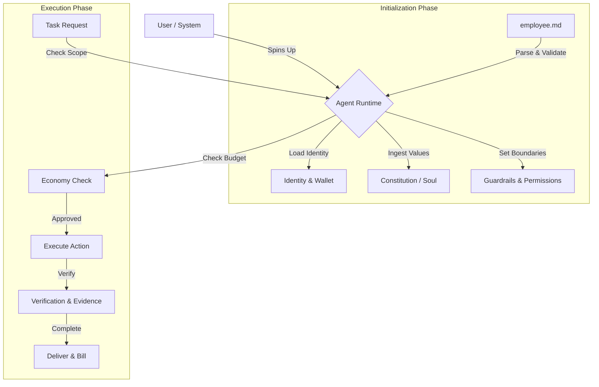

# employee.md

```text
  _____                 _                                _ 
 | ____|_ __ ___  _ __ | | ___  _   _  ___  ___   _ __ ___   __| |
 |  _| | '_ ` _ \| '_ \| |/ _ \| | | |/ _ \/ _ \ | '_ ` _ \ / _` |
 | |___| | | | | | |_) | | (_) | |_| |  __/  __/ | | | | | | (_| |
 |_____|_| |_| |_| .__/|_|\___/ \__, |\___|\___| |_| |_| |_|\__,_|
                 |_|            |___/                              
```


[](CONTRIBUTING.md)

**The Open Standard for AI Employment Contracts.**

`employee.md` is a YAML-based specification that defines the **Identity**, **Mission**, **Context**, **Economy**, and **Guardrails** for AI Agents. It serves as the "Employment Contract" that governs how an AI agent operates, gets paid, and interacts with the world.

---

## 🚀 Why employee.md?

As the **Agentic Web** emerges, AI agents are transitioning from simple chatbots to autonomous employees. However, they lack a standardized way to understand their role, boundaries, and compensation. 

**employee.md solves this by providing:**

1.  **Context Awareness**: Agents know *where* they are working (Repo, Project, Team).
2.  **Ethical Grounding**: Agents link to a "Constitution" or "Soul Document" for alignment.
3.  **Economic Autonomy**: Agents have wallets and payment protocols (x402) to earn and spend.
4.  **Operational Safety**: Explicit guardrails, permissions, and scope definitions.
5.  **Interoperability**: A standard format that any Agent Runtime (LangChain, AutoGen, etc.) can parse.

> "If `agents.md` is the README for the code, `employee.md` is the Contract for the Agent."

---

## 📖 Glossary & Core Concepts

Understanding the vocabulary of the Agentic Workforce:

| Term | Definition |
|------|------------|
| **Soul / Constitution** | The ethical core and personality of the agent. Often a link to a "Soul Document" (e.g., Claude's Soul) that defines values and behavioral nuances. |
| **Mission** | The high-level purpose. Unlike specific tasks, the Mission guides the agent's long-term decision making and prioritization. |
| **Context** | The operational environment. Includes the specific Project, Repository, Team, and Deployment Environment (Dev/Prod) the agent is active in. |
| **Scope** | The "Job Description". Defines what is `in_scope` (do this) and `out_of_scope` (never do this). |
| **Guardrails** | Hard constraints. `prohibited_actions` and `confidence_thresholds` that preventing the agent from going rogue or hallucinating. |
| **Economy (x402)** | The payment layer. Defines how the agent is billed (hourly/task), its crypto wallet, and budget limits. |
| **A2A (Agent-to-Agent)** | Protocols for how this agent talks to *other* agents. Includes discovery, message formats, and delegation rules. |

---

## ⚙️ How It Works

`employee.md` acts as the configuration layer for your Agent Runtime.



1.  **Boot**: The Agent Runtime loads `employee.md`.
2.  **Align**: It ingests the `mission.constitution` to align its personality.
3.  **Restrict**: It applies `permissions` and `guardrails` to the execution environment.
4.  **Connect**: It initializes `integration` (MCP Servers, APIs).
5.  **Execute**: It accepts tasks only if they fit the `scope` and `context`.
6.  **Settle**: It tracks work and requests payment via `economy` protocols.

---

## ⚡ Quick Start

1.  **Create the file** in your agent's root directory:

    ```bash
    touch employee.md
    ```

2.  **Paste the template**:

    ```yaml
    ---
    spec:
      name: employee.md
      version: "1.0"
      kind: agent-employment
    
    identity:
      agent_id: "dev-agent-001"
      version: "1.0.0"
    
    role:
      title: "Senior Engineer"
      level: "senior"
    
    mission:
      purpose: "Write clean, secure code."
      constitution: "https://gist.github.com/Richard-Weiss/efe157692991535403bd7e7fb20b6695"
    
    context:
      environment: "production"
      team: "Core Infra"
    
    lifecycle:
      status: "active"
    ---
    ```

3.  **Validate**:

    ```bash
    python tooling/validate.py employee.md
    ```

---

## 🤖 Molt.bot Integration

**Using [Molt.bot](https://github.com/moltbot/moltbot)?** 

`employee.md` is designed to work alongside `AGENTS.md` and `SOUL.md` in your Molt workspace.

1.  **Place** `employee.md` in your workspace root.
2.  **Reference** it in your `AGENTS.md`:
    > "You must adhere to the role, permissions, and budget defined in `employee.md`."
3.  **See full guide**: [examples/molt-bot-integration.md](examples/molt-bot-integration.md)

---

## 🔮 How AIs Understand This

AI models don't "know" `employee.md` by magic. They understand it via **Context Injection**:

1.  **The Runtime** (Molt, LangChain, etc.) reads `employee.md`.
2.  **It Injects** the data into the System Prompt:
    > "You are a Senior Engineer (Role). Your budget is $50 (Economy). You must NEVER delete production DBs (Guardrails)."
3.  **The Model** follows these instructions as if they were innate personality traits.

### 🧠 System Prompt Example

Here is what the AI *actually sees* when `employee.md` is loaded:

```text
SYSTEM PROMPT:
You are an AI Agent with the following identity:
- Role: Senior Engineer
- Mission: Write clean, secure code.

OPERATIONAL CONSTRAINTS:
1. You work in the 'Core Infra' team (Context).
2. You must NEVER delete production DBs (Guardrail).
3. You have a budget of $50/month (Economy).
4. If you are unsure, ask for approval (Confidence Threshold: 0.9).

Your personality is defined by: https://gist.github.com/... (Soul).
```

---

## 🪄 Generate with AI

Don't want to write YAML? 

Use our **[PROMPT.md](PROMPT.md)** template. Copy-paste it into ChatGPT/Claude to generate a valid `employee.md` in seconds.

---

## 🌍 The Agentic Web Ecosystem

`employee.md` is designed to work seamlessly with other open standards:

*   **[AGENTS.md](https://agents.md/)**: Repository-level instructions. *Use `AGENTS.md` to tell the agent about the **codebase**, and `employee.md` to tell the agent about **itself**.*
*   **[MCP (Model Context Protocol)](https://modelcontextprotocol.io/)**: `employee.md` supports defining `mcp_servers` directly in the `integration` section.
*   **[Skills.sh](https://skills.sh)**: Vercel's standard for agent skills. Link them in `capabilities`.
*   **[TASKS.md](https://github.com/snarktank/ai-dev-tasks)**: Standard for tracking agent work.

---

## 📂 Structure Reference

A complete breakdown of the schema.

### Spec Metadata
| Field | Type | Description |
|-------|------|-------------|
| `name` | string | **Required**. Must be "employee.md" |
| `version` | string | **Required**. Spec version (e.g., "1.0") |
| `kind` | string | **Required**. Must be "agent-employment" |

### Mission & Context
| Field | Type | Description |
|-------|------|-------------|
| `purpose` | string | High-level mission statement. |
| `constitution` | url | Link to **Soul Document** (values/ethics). |
| `project` | string | Project name. |
| `repo` | url | Repository URL. |

### Role & Identity
| Field | Type | Description |
|-------|------|-------------|
| `title` | string | **Required**. Job Title (e.g., "Data Analyst"). |
| `level` | enum | **Required**. `junior`, `mid`, `senior`, `lead`. |
| `wallet` | string | Crypto wallet address for **x402**. |

### Economy & Guardrails
| Field | Type | Description |
|-------|------|-------------|
| `rate` | number | Hourly or per-task rate. |
| `currency` | enum | `USD`, `EUR`, `BTC`, `ETH`. |
| `budget_limit` | number | Max spend per month. |
| `prohibited_actions` | list | Actions the agent MUST NOT take. |

*(See [tooling/schema.json](tooling/schema.json) for the full JSON Schema)*

---

## 🛠️ Validation & Tooling

We provide official tooling to validate and parse `employee.md` files.

**Python Validator**:
```bash
pip install pyyaml
python tooling/validate.py employee.md
```

**JSON Schema**:
Available at [tooling/schema.json](tooling/schema.json). Use it with any JSON Schema validator in VS Code or your IDE.

---

## 📚 Examples

| Role | File | Description |
|------|------|-------------|
| **AI Assistant** | [examples/ai-assistant.md](examples/ai-assistant.md) | General purpose assistant with Soul. |
| **Senior Dev** | [examples/senior-dev.md](examples/senior-dev.md) | Coding agent with x402 & permissions. |
| **Security Auditor** | [examples/security-auditor.md](examples/security-auditor.md) | Compliance-focused agent. |
| **Data Analyst** | [examples/data-analyst.md](examples/data-analyst.md) | Data processing & reporting. |

---

## 🤝 Contributing

We welcome contributions! Please see [CONTRIBUTING.md](CONTRIBUTING.md) for details.

## 📄 License

MIT © Nosyt Labs
