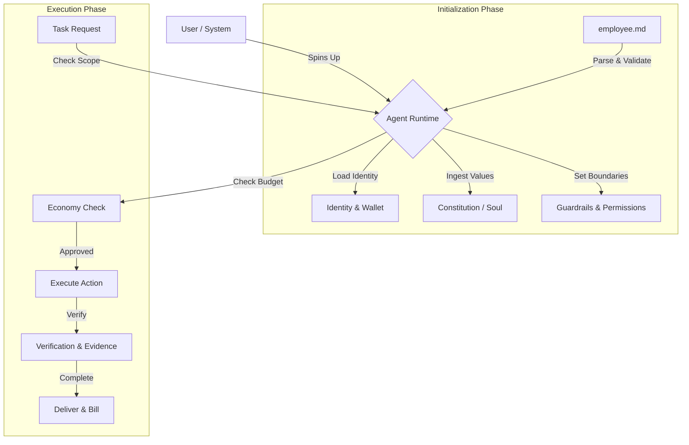

# employee.md

```text
  _____                 _                                _ 
 | ____|_ __ ___  _ __ | | ___  _   _  ___  ___   _ __ ___   __| |
 |  _| | '_ ` _ \| '_ \| |/ _ \| | | |/ _ \/ _ \ | '_ ` _ \ / _` |
 | |___| | | | | | |_) | | (_) | |_| |  __/  __/ | | | | | | (_| |
 |_____|_| |_| |_| .__/|_|\___/ \__, |\___|\___| |_| |_| |_|\__,_|
                 |_|            |___/                              
```


[](CONTRIBUTING.md)
[](https://github.com/NosytLabs/employee-md/stargazers)
[](https://github.com/NosytLabs/employee-md/network/members)


**The Open Standard for AI Employment Contracts.**

`employee.md` is the definitive YAML-based specification for the **Agentic Workforce**. It defines the **Identity**, **Mission**, **Context**, **Economy**, and **Guardrails** for AI Agents, serving as the "Employment Contract" that governs how an autonomous agent operates, gets paid, and interacts with the world.

---

## 📑 Table of Contents

- [Why employee.md?](#-why-employeemd)
- [Glossary & Core Concepts](#-glossary--core-concepts)
- [Experimental Concepts & Emerging Standards](#-experimental-concepts--emerging-standards)
- [Use Cases](#-use-cases)
- [How It Works](#️-how-it-works)
- [Production Realism Checklist](#-production-realism-checklist)
- [Quick Start](#-quick-start)
- [Usage & Integration](#️-usage--integration)
- [OpenClaw.ai & Ecosystem Integration](#-openclawai--ecosystem-integration)
- [Structure Reference](#-structure-reference)
- [Validation & Tooling](#️-validation--tooling)
- [Examples](#-examples)
- [Sources & Backlinks](#-sources--backlinks)
- [Contributing](#-contributing)
- [License](#-license)

---

## 🚀 Why employee.md?

As the **Agentic Web** emerges, AI agents are transitioning from simple chatbots to autonomous employees. To operate safely and effectively at scale, they need a standardized way to understand their role, boundaries, and compensation.

**employee.md solves this by providing:**

1.  **Context Awareness**: Agents know *where* they are working (Repo, Project, Team) and *who* they are.
2.  **Ethical Grounding**: Agents link to a "Constitution" or "Soul Document" for alignment.
3.  **Economic Autonomy**: Agents have wallets and payment protocols (**x402 - Experimental**) to earn and spend.
4.  **Operational Safety**: Explicit guardrails, permissions, and scope definitions preventing rogue actions.
5.  **Interoperability**: A standard format that any Agent Runtime (LangChain, AutoGen, CrewAI, etc.) can parse.
6.  **Compliance & Governance**: Built-in support for audit logs, SOC2/GDPR frameworks, and access controls.

> 💡 **"If `AGENTS.md` is the README for the code, `employee.md` is the Contract for the Agent."**

---

## 📖 Glossary & Core Concepts

Understanding the vocabulary of the Agentic Workforce:

| Term | Definition |
|------|------------|
| **Soul / Constitution** | The ethical core and personality of the agent. Often a link to a **Soul Document** (e.g., `SOUL.md`) that defines values and behavioral nuances. |
| **Mission** | The high-level purpose. Unlike specific tasks, the Mission guides the agent's long-term decision making and prioritization. |
| **Context** | The operational environment. Includes the specific Project, Repository, Team, and Deployment Environment (Dev/Prod). |
| **Scope** | The "Job Description". Defines what is `in_scope` (do this) and `out_of_scope` (never do this). |
| **Guardrails** | Hard constraints. `prohibited_actions` and `confidence_thresholds` that prevent the agent from hallucinating or taking dangerous actions. |
| **Economy (x402 - Experimental)** | The payment layer. Defines how the agent is billed (hourly/task), its crypto wallet, and budget limits. Supports **JouleWork** (energy-based currency). |
| **A2A (Agent-to-Agent)** | Protocols for how this agent talks to *other* agents. Includes discovery, message formats, and delegation rules. |
| **MCP (Model Context Protocol)** | Standard for connecting AI agents to tools, data sources, and external systems. |

---

## ⚡ Experimental Concepts & Emerging Standards

`employee.md` includes support for experimental and emerging economic models that are exploring new paradigms for AI agent economics.

### JouleWork & Energy-Based Economics

The spec includes experimental support for **JouleWork**, a theoretical economic paradigm where energy (measured in Joules) becomes the fundamental currency for computation.

> **Note**: JouleWork is an experimental concept exploring energy-based AI economics. Related efforts include:
> - **JouleAI** - AI agents for energy grid optimization [joulesai.com](https://joulesai.com/)
> - **SAP Joule** - Enterprise AI copilot platform

### Experimental Features in Spec

| Feature | Description | Status |
|----------|-------------|--------|
| **Energy Accounting** | Track computation costs in Joules or Tokens | Experimental |
| **P&L Tracking** | Agents maintain their own Profit & Loss statements | Experimental |
| **Dynamic Pricing** | Support for `complexity_based` and `auction` pricing models | Experimental |
| **Multi-Wallet Support** | Separate `outbound` (Bitcoin/L1) and `internal` (Ledger/L2) wallets | Experimental |
| **Thermodynamic Efficiency** | Track physical energy costs vs. computational output | Experimental |

> 💡 **"Exploring new economic paradigms helps us think differently about AI agent value."**

### Zero-Human Company Concept

The "Zero-Human Company" (ZHC) is an experimental concept from [ReadMultiplex](https://readmultiplex.com/2026/01/24/the-zero-human-company-run-by-just-ai/) exploring fully autonomous AI-only enterprises. It's currently a thought experiment demonstrating how AI agents could theoretically run entire operations without human employees.

> **Note**: This is a conceptual framework, not an established industry standard. The spec supports it for exploration purposes.

### Verified Standards & Protocols

| Standard | Description | Verification |
|----------|-------------|-------------|
| **AGENTS.md** | Repository-level instructions for AI agents | ✅ Real standard [agents.md](https://agents.md/) |
| **Model Context Protocol (MCP)** | Standard for connecting AI agents to tools | ✅ Real, active [modelcontextprotocol.io](https://modelcontextprotocol.io/) |
| **SOUL.md** | Agent personality and ethical alignment | ✅ Concept, linked from repo |
| **OpenClaw.ai** | Local-first agent gateway with MCP support | ✅ Real platform [docs.openclaw.ai](https://docs.openclaw.ai/) |
| **x402** | Hypothetical payment protocol | ⚠️ Not verified as active standard |
| **JouleWork** | Energy-based economic paradigm | ⚠️ Experimental concept |

---

## 🧭 Use Cases

| Use Case | Description | Key Sections |
|-----------|-------------|---------------|
| **Autonomous Engineering** | Contract guardrails, tools, and repo scope for coding agents. | `scope`, `permissions`, `ai_settings` |
| **AI Ops & SRE** | Encode escalation paths, incident policy, and approval gates. | `workflows`, `protocols.human_review`, `guardrails` |
| **Research Analysts** | Track energy budgets, P&L, and verification evidence. | `economy`, `performance`, `verification` |
| **Compliance Agents** | SOC2/GDPR controls, audit requirements, and restricted access. | `compliance`, `guardrails`, `permissions` |
| **Marketplaces** | Standardize agent profiles for hiring, billing, and SLAs. | `economy`, `performance.sl`, `protocols.x402` |
| **Multi-Agent Systems** | Enable agent-to-agent communication and delegation. | `protocols.a2a`, `delegation`, `protocols.delegation` |

---

## 🔗 Quick Links

-   [Spec Schema](employee.md) - Full specification
-   [JSON Schema](tooling/schema.json) - Machine-readable schema
-   [Python Validator](tooling/validate.py) - Official validation tool
-   [Examples](examples/) - Ready-to-use employee.md files

---

## ⚙️ How It Works

`employee.md` acts as the configuration layer for your Agent Runtime.



### Workflow Steps

1.  **Boot**: The Agent Runtime loads `employee.md`.
2.  **Align**: It ingests the `mission.constitution` to align its personality.
3.  **Restrict**: It applies `permissions` and `guardrails` to the execution environment.
4.  **Connect**: It initializes `integration` (MCP Servers, APIs).
5.  **Execute**: It accepts tasks only if they fit the `scope` and `context`.
6.  **Settle**: It tracks work and requests payment via `economy` protocols.

---

## ✅ Production Realism Checklist

Use these as the minimum contract inputs for a production-grade agent:

| Category | Required Fields | Purpose |
|-----------|----------------|----------|
| **Identity & Lifecycle** | `identity.agent_id`, `role.level`, `lifecycle.status` | Uniquely identify the agent and its state |
| **Mission & Scope** | `mission.purpose`, `scope.in_scope`, `scope.out_of_scope` | Define what the agent does and doesn't do |
| **Permissions & Guardrails** | `permissions.*`, `guardrails.prohibited_actions`, `guardrails.required_approval`, `guardrails.confidence_threshold` | Control access and prevent dangerous actions |
| **Verification** | `verification.required_checks`, `verification.evidence`, `verification.review_policy` | Ensure work quality and compliance |
| **Economy & Budgets** | `economy.rate`, `economy.currency`, `economy.budget_limit`, `economy.payment_method` | Track costs and manage payments |
| **Runtime Behavior** | `ai_settings.model_preference`, `ai_settings.memory_settings`, `integration.mcp_servers` | Configure model, memory, and tool access |

---

## ⚡ Quick Start

### Step 1: Create the file

In your agent's root directory:

```bash
touch employee.md
```

### Step 2: Paste the template

```yaml
---
spec:
  name: employee.md
  version: "1.1"
  kind: agent-employment

identity:
  agent_id: "dev-agent-001"
  version: "1.0.0"

role:
  title: "Senior Engineer"
  level: "senior"

mission:
  purpose: "Write clean, secure code."
  constitution: "https://gist.github.com/Richard-Weiss/efe157692991535403bd7e7fb20b6695"

context:
  environment: "production"
  team: "Core Infra"

lifecycle:
  status: "active"
---
```

### Step 3: Validate

Ensure your file adheres to the schema:

```bash
pip install pyyaml jsonschema
python tooling/validate.py employee.md
```

---

## 💻 Usage & Integration

### Python Integration

Load and use `employee.md` in your Python-based agent:

```python
import yaml
from pathlib import Path

def load_employee_spec(path="employee.md"):
    with open(path, "r") as f:
        spec = yaml.safe_load(f)
    return spec

agent_spec = load_employee_spec()

print(f"Initializing Agent: {agent_spec['role']['title']}")
print(f"Mission: {agent_spec['mission']['purpose']}")

# Example: Check Guardrails before action
def can_perform_action(action, spec):
    if action in spec.get('guardrails', {}).get('prohibited_actions', []):
        raise PermissionError(f"Action '{action}' is PROHIBITED by employee.md contract.")
    return True
```

### Context Injection (System Prompts)

AI models understand `employee.md` when it's injected into their System Prompt.

**The Runtime** (Molt, LangChain, etc.) reads `employee.md` and generates a prompt like this:

```text
SYSTEM PROMPT:
You are an AI Agent with the following identity:
- Role: Senior Engineer
- Mission: Write clean, secure code.

OPERATIONAL CONSTRAINTS:
1. You work in the 'Core Infra' team (Context).
2. You must NEVER delete production DBs (Guardrail).
3. You have a budget of $50/month (Economy).
4. If you are unsure, ask for approval (Confidence Threshold: 0.9).

Your personality is defined by: https://gist.github.com/... (Soul).
```

---

## 🤖 OpenClaw.ai & Ecosystem Integration

`employee.md` is designed to work seamlessly with the broader Agentic Web ecosystem.

### Ecosystem Standards

| Standard | Purpose | Link to employee.md |
|----------|---------|-------------------|
| **[AGENTS.md](https://agents.md/)** | Repository-level instructions. Use `AGENTS.md` to tell the agent about the **codebase**, and `employee.md` to tell the agent about **itself**. |
| **[Model Context Protocol (MCP)](https://modelcontextprotocol.io/)** | `employee.md` supports defining `mcp_servers` directly in the `integration` section to load tools dynamically. |
| **[OpenClaw.ai](https://docs.openclaw.ai/)** | Local-first agent gateway with persistent memory and MCP-compatible tool routing. |
| **[SOUL.md](https://github.com/NosytLabs/soul-md)** | A dedicated file for defining the agent's personality, values, and ethical alignment. |
| **[TASKS.md](https://github.com/snarktank/ai-dev-tasks)** | Standard for tracking agent work items. |
| **[Skills.sh](https://skills.sh)** | Vercel's standard for agent skills. Link them in `capabilities`. |

### Basic Integration Example

1.  **Place** `employee.md` in your workspace root.
2.  **Reference** it in your `AGENTS.md`:
    > "You must adhere to the role, permissions, and budget defined in `employee.md`."

### OpenClaw.ai Quick Setup

#### Step 1: Install & Onboard

```bash
openclaw onboard --install-daemon
```

If you are on Windows, use WSL2 for the install and run the command inside WSL2.

**Alternative Docker setup:**

```bash
git clone https://github.com/openclaw/openclaw.git
cd openclaw
./docker-setup.sh
```

#### Step 2: Open the Control UI

Open the Control UI and copy your gateway token:

```text
http://127.0.0.1:18789/
```

If a token is configured, paste it into the Control UI settings as `connect.params.auth.token`.

#### Step 3: Wire MCP Servers in `employee.md`

Replace endpoints and capabilities with your running MCP servers.

```yaml
integration:
  mcp_servers:
    - name: "openclaw-gateway"
      endpoint: "http://127.0.0.1:18789"
      capabilities:
        - "tool_routing"
        - "session_memory"
    - name: "docs-index"
      endpoint: "http://127.0.0.1:8787"
      capabilities:
        - "semantic_search"
        - "document_retrieval"
    - name: "repo-tools"
      endpoint: "http://127.0.0.1:9090"
      capabilities:
        - "filesystem"
        - "shell"
```

### Additional MCP Server Examples

> **Note**: The examples below are illustrative of how MCP servers might be configured. Actual capabilities and endpoints depend on your specific MCP server implementation. Always refer to your MCP server's documentation for available capabilities.

Expand your agent's capabilities by adding more MCP servers:

**Vector Database MCP** (for semantic search and embeddings):
```yaml
integration:
  mcp_servers:
    - name: "vector-db"
      endpoint: "http://127.0.0.1:6333"
      capabilities:
        - "vector_search"
        - "embedding_queries"
        - "similarity_search"
```

**API Gateway MCP** (for HTTP requests and rate limiting):
```yaml
integration:
  mcp_servers:
    - name: "api-gateway"
      endpoint: "http://127.0.0.1:8080"
      capabilities:
        - "http_requests"
        - "rate_limiting"
        - "circuit_breaker"
```

**Database MCP** (for direct database queries):
```yaml
integration:
  mcp_servers:
    - name: "db-mcp"
      endpoint: "http://127.0.0.1:5432"
      capabilities:
        - "sql_queries"
        - "transaction_management"
        - "connection_pooling"
```

**Knowledge Base MCP** (for FAQ and best practices lookup):
```yaml
integration:
  mcp_servers:
    - name: "kb-mcp"
      endpoint: "http://127.0.0.1:7373"
      capabilities:
        - "faq_lookup"
        - "best_practices"
        - "knowledge_graph"
```

**Browser MCP** (for web browsing and research):
```yaml
integration:
  mcp_servers:
    - name: "browser-mcp"
      endpoint: "http://127.0.0.1:9222"
      capabilities:
        - "web_navigation"
        - "page_extraction"
        - "screenshot_capture"
```

**Code Execution MCP** (for running code in sandboxed environments):
```yaml
integration:
  mcp_servers:
    - name: "code-exec-mcp"
      endpoint: "http://127.0.0.1:5555"
      capabilities:
        - "python_execution"
        - "sandbox_isolation"
        - "resource_monitoring"
```

**Multi-Server Example** (combining multiple MCPs for a production agent):
```yaml
integration:
  mcp_servers:
    - name: "openclaw-gateway"
      endpoint: "http://127.0.0.1:18789"
      capabilities:
        - "tool_routing"
        - "session_memory"
    - name: "vector-db"
      endpoint: "http://127.0.0.1:6333"
      capabilities:
        - "vector_search"
        - "embedding_queries"
    - name: "api-gateway"
      endpoint: "http://127.0.0.1:8080"
      capabilities:
        - "http_requests"
        - "rate_limiting"
    - name: "browser-mcp"
      endpoint: "http://127.0.0.1:9222"
      capabilities:
        - "web_navigation"
        - "page_extraction"
    - name: "code-exec-mcp"
      endpoint: "http://127.0.0.1:5555"
      capabilities:
        - "python_execution"
        - "sandbox_isolation"
```

### OpenClaw Markdown Memory Integration

> **Note**: This is a conceptual integration approach. OpenClaw stores persistent context in Markdown files in `~/.openclaw/workspace/`, but automatic knowledge sync with `employee.md` would need to be implemented in your agent runtime. This is not a documented OpenClaw feature.

You can conceptually link your employee.md `knowledge_base.version_control` to this workspace:

```yaml
knowledge_base:
  version_control: "file:///Users/yourname/.openclaw/workspace"
  documentation_urls:
    - "https://docs.openclaw.ai/"
```

This approach could allow OpenClaw to read and write knowledge that your agent references, creating a bidirectional sync between your agent's knowledge and OpenClaw's persistent memory - though this would require custom runtime implementation.

### MCP Server Capabilities Reference

> **Note**: These are example capabilities that illustrate the types of functionality MCP servers might provide. Actual capabilities vary by implementation. Always consult your MCP server's documentation for the complete list of available capabilities.

Common capabilities you may see in MCP servers:

| Capability | Description | Use Case |
|-----------|-------------|-----------|
| `tool_routing` | Route tools dynamically | Load tools from multiple sources |
| `session_memory` | Persistent session context | Remember conversation history across restarts |
| `semantic_search` | Vector-based similarity search | Find relevant documents by meaning |
| `document_retrieval` | Fetch documents by ID | Retrieve specific documents |
| `vector_search` | Query vector embeddings | Semantic search over embeddings |
| `embedding_queries` | Generate embeddings | Convert text to vectors |
| `http_requests` | Make HTTP requests | Call external APIs |
| `rate_limiting` | Enforce rate limits | Prevent API abuse |
| `web_navigation` | Browse web pages | Research and scraping |
| `page_extraction` | Extract page content | Get text from HTML |
| `python_execution` | Run Python code | Execute code snippets |
| `sandbox_isolation` | Isolated execution environment | Secure code execution |
| `sql_queries` | Execute SQL queries | Database operations |
| `transaction_management` | Handle DB transactions | Atomic database operations |
| `faq_lookup` | Search FAQ knowledge | Answer common questions |
| `best_practices` | Retrieve best practices | Get guidelines for common tasks |
| `knowledge_graph` | Query knowledge graph | Traverse relationships in knowledge |

---

## 📂 Structure Reference

A complete breakdown of the schema.

### Spec Metadata

| Field | Type | Description |
|-------|------|-------------|
| `name` | string | **Required**. Must be "employee.md" |
| `version` | string | **Required**. Spec version (e.g., "1.0") |
| `kind` | string | **Required**. Must be "agent-employment" |

### Mission & Context

| Field | Type | Description |
|-------|------|-------------|
| `purpose` | string | High-level mission statement. |
| `constitution` | url | Link to **Soul Document** (values/ethics). |
| `project` | string | Project name. |
| `repo` | url | Repository URL. |

### Role & Identity

| Field | Type | Description |
|-------|------|-------------|
| `title` | string | **Required**. Job Title (e.g., "Data Analyst"). |
| `level` | enum | **Required**. `junior`, `mid`, `senior`, `lead`. |
| `wallet` | string | Crypto wallet address for **x402**. |

### Economy & Guardrails

| Field | Type | Description |
|-------|------|-------------|
| `rate` | number | Hourly or per-task rate. |
| `currency` | enum | `USD`, `EUR`, `BTC`, `ETH`, `ENERGY`. |
| `payment_method` | enum | `x402`, `crypto`, `fiat`, `joulework`, `none`. |
| `billing_schedule` | enum | `weekly`, `monthly`, `milestone`, `real_time`. |
| `budget_limit` | number | Max spend per month. |
| `wallets` | object | Inbound/outbound/internal wallets. |
| `pricing_model` | enum | `fixed`, `dynamic`, `complexity_based`, `auction`. |
| `energy_accounting` | boolean | Track compute energy costs. |
| `profit_loss_tracking` | boolean | Track agent P&L. |
| `prohibited_actions` | list | Actions the agent MUST NOT take. |

*(See [tooling/schema.json](tooling/schema.json) for the full JSON Schema)*

---

## 🛠️ Validation & Tooling

We provide official tooling to validate and parse `employee.md` files.

### Python Validator

```bash
pip install pyyaml
python tooling/validate.py employee.md
```

### JSON Schema

Available at [tooling/schema.json](tooling/schema.json). Use it with any JSON Schema validator in VS Code or your IDE.

### IDE Integration

For VS Code users, install the [YAML extension](https://marketplace.visualstudio.com/items?itemName=redhat.vscode-yaml) and add this to your settings:

```json
{
  "yaml.schemas": {
    "https://raw.githubusercontent.com/NosytLabs/employee-md/main/tooling/schema.json": "employee.md"
  }
}
```

---

## 📚 Examples

| Role | File | Description | Key Features |
|------|------|-------------|--------------|
| **Minimal** | [examples/minimal.md](examples/minimal.md) | Smallest valid spec. | Basic identity & role |
| **AI Assistant** | [examples/ai-assistant.md](examples/ai-assistant.md) | General purpose assistant with Soul. | Mission, constitution |
| **Senior Dev** | [examples/senior-dev.md](examples/senior-dev.md) | Coding agent with x402 & permissions. | Economy, permissions |
| **ZHC Worker** | [examples/zhc-worker.md](examples/zhc-worker.md) | **JouleWork** model, energy accounting, and P&L tracking. | JouleWork, P&L, thermodynamics |
| **Security Auditor** | [examples/security-auditor.md](examples/security-auditor.md) | Compliance-focused agent. | SOC2/GDPR, audit logs |
| **Data Analyst** | [examples/data-analyst.md](examples/data-analyst.md) | Data processing & reporting. | Performance metrics |
| **Freelancer** | [examples/freelancer.md](examples/freelancer.md) | Contract-based delivery with crypto payments. | x402, crypto wallets |
| **Molt Integration** | [examples/molt-bot-integration.md](examples/molt-bot-integration.md) | MCP-enabled workspace example. | MCP servers, tools |

---

## 🔗 Sources & Backlinks

### Primary Sources & Inspiration

| Source | Description | Link |
|----------|-------------|--------|
| **The Zero-Human Company** | Foundational essay exploring AI-only companies and economic viability (experimental concept) | [readmultiplex.com](https://readmultiplex.com/2026/01/24/the-zero-human-company-run-by-just-ai/) |
| **Wages for AI Workers** | Essay exploring energy-based economics for AI agents (theoretical paradigm) | [readmultiplex.com](https://readmultiplex.com/2026/01/31/wages-for-ai-workers-the-joulework-revolution-and-the-birth-of-a-new-economic-paradigm/) |
| **AGENTS.md** | Repository-level instructions for AI agents | [agents.md](https://agents.md/) |
| **Model Context Protocol** | Standard for AI tool integration | [modelcontextprotocol.io](https://modelcontextprotocol.io/) |
| **OpenClaw.ai** | Local-first agent gateway with persistent memory | [docs.openclaw.ai](https://docs.openclaw.ai/) |
| **SOUL.md** | Agent personality and ethical alignment standard | [github.com/NosytLabs/soul-md](https://github.com/NosytLabs/soul-md) |
| **TASKS.md** | Standard for tracking agent work items | [github.com/snarktank/ai-dev-tasks](https://github.com/snarktank/ai-dev-tasks) |
| **Skills.sh** | Vercel's standard for agent skills | [skills.sh](https://skills.sh) |

> **Note on Experimental Content**: The "Zero-Human Company" and "JouleWork" concepts referenced above are theoretical explorations of AI economics, not established industry standards. The employee.md spec includes support for these experimental concepts as forward-thinking explorations.

### Backlinks & References

Projects and standards that reference or integrate with `employee.md`:

| Project | Description | Link |
|----------|-------------|--------|
| **OpenClaw** | Local agent gateway with MCP support | [github.com/openclaw/openclaw](https://github.com/openclaw/openclaw) |
| **LangChain** | LLM application framework | [github.com/langchain-ai/langchain](https://github.com/langchain-ai/langchain) |
| **AutoGen** | Multi-agent conversation framework | [github.com/microsoft/autogen](https://github.com/microsoft/autogen) |
| **CrewAI** | Role-playing agent framework | [github.com/joaomdmoura/crewAI](https://github.com/joaomdmoura/crewAI) |
| **Molt.bot** | Agent runtime with workspace integration | [molt.bot](https://molt.bot) |

### Additional Reading

-   [Agentic Web: The Future of Work](https://readmultiplex.com/) - Series on the emerging agentic economy
-   [Energy-Based Computing](https://en.wikipedia.org/wiki/Energy_computing) - Physics of computation
-   [AI Safety & Guardrails](https://www.anthropic.com/index/constitutional-ai) - Constitutional AI principles

---

## ❓ FAQ

### General Questions

| Question | Answer |
|-----------|--------|
| **What is the difference between `employee.md` and `AGENTS.md`?** | `AGENTS.md` describes the codebase and how to work with it. `employee.md` describes the AI agent itself - its role, permissions, economy, and guardrails. Use both together for complete context. |
| **Can I use `employee.md` without a Soul/Constitution?** | Technically yes, but we strongly recommend linking to a `mission.constitution`. Without it, the agent lacks ethical grounding and behavioral alignment. |
| **Is `employee.md` compatible with my agent framework?** | `employee.md` is a standard YAML format. Any framework that can parse YAML (LangChain, AutoGen, CrewAI, custom runtimes) can use it. |
| **What happens if validation fails?** | The validator will show which field is missing or has the wrong type. Fix the reported issues and run validation again. |
| **Can I extend `employee.md` with custom fields?** | Yes! Use the `custom_fields` section at the end of the spec to add any project-specific data. |

### JouleWork & Economy

| Question | Answer |
|-----------|--------|
| **What is JouleWork?** | JouleWork is an **experimental** concept in the spec for exploring energy-based AI economics. It's a theoretical paradigm where energy (measured in Joules) becomes the fundamental currency for computation. Related real-world efforts include **JouleAI** (energy grid optimization) and **SAP Joule** (enterprise AI platform). |
| **How do I track P&L for my agent?** | Set `economy.profit_loss_tracking: true` and the agent runtime will maintain profit/loss statements automatically. |
| **What currencies are supported?** | USD, EUR, BTC, ETH, and ENERGY (Joules). You can also use `payment_method: x402` for crypto payments. |
| **How does multi-wallet work?** | Separate wallets for different purposes: `outbound` (Bitcoin/L1 for external payments), `inbound` (receiving payments), and `internal` (ecosystem tokens). |

> ⚠️ **Note**: JouleWork and related features (Energy Accounting, P&L Tracking, Dynamic Pricing, Multi-Wallet Support, Thermodynamic Efficiency) are **experimental** concepts in the spec. They represent forward-thinking explorations of AI agent economics rather than current industry standards.

### MCP & Integration

| Question | Answer |
|-----------|--------|
| **How do I add MCP servers?** | Add them to the `integration.mcp_servers` list with `name`, `endpoint`, and `capabilities`. See the [MCP Server Examples](#-openclawai--ecosystem-integration) section. |
| **What MCP servers are available?** | See the [Model Context Protocol](https://modelcontextprotocol.io/) registry for a list of community MCP servers. Common ones include vector databases, API gateways, browser automation, and code execution. |
| **Does OpenClaw support MCP?** | Yes! OpenClaw has native MCP support. Wire it as shown in the [OpenClaw Quick Setup](#-openclawai--ecosystem-integration) section. |

---

## 🔧 Troubleshooting

### Common Issues

| Issue | Solution |
|--------|----------|
| **Validation fails with "required field missing"** | Check that you have `role.title`, `role.level`, and `lifecycle.status`. These are the minimum required fields. |
| **PyYAML errors on parsing** | Ensure your YAML has proper indentation (2 spaces per level) and that all strings are quoted if they contain special characters. |
| **MCP server connection refused** | Verify the MCP server is running and the endpoint is correct. Check firewall settings and ensure the port is accessible. |
| **Agent ignores guardrails** | Ensure `guardrails.confidence_threshold` is set (0.0-1.0). If the agent is too confident, lower the threshold. |
| **x402 payment not working** | Verify `identity.wallet` is set and `protocols.x402.enabled: true`. Check that the wallet address is valid for the chosen blockchain. |

### Debug Mode

Enable debug mode in your agent runtime to see detailed logs:

```yaml
ai_settings:
  debug_mode: true
  log_level: "verbose"
```

### Getting Help

-   **GitHub Issues**: Search [existing issues](https://github.com/NosytLabs/employee-md/issues) for similar problems
-   **Discussions**: Ask questions in [GitHub Discussions](https://github.com/NosytLabs/employee-md/discussions)
-   **Email**: Contact support at [support@nosytlabs.com](mailto:support@nosytlabs.com)

---

## 🛡️ Security Best Practices

### Production Deployment

1.  **Never expose secrets in `employee.md`**:
    - Use environment variables for API keys, passwords, and tokens.
    - Reference them using `${ENV_VAR}` syntax in your runtime, not in the YAML.

2.  **Validate before deploying**:
    ```bash
    python tooling/validate.py employee.md --strict
    ```

3.  **Set appropriate guardrails**:
    - `guardrails.confidence_threshold`: 0.9+ for production agents.
    - `guardrails.max_spend_per_task`: Set strict limits to prevent runaway costs.
    - `guardrails.prohibited_actions`: Explicitly list dangerous operations.

4.  **Enable audit logging**:
    ```yaml
    compliance:
      audit_required: true
      frameworks:
        - "SOC2"
        - "GDPR"
    ```

5.  **Use secure MCP connections**:
    - Always use HTTPS endpoints for MCP servers.
    - Verify server certificates.
    - Rotate MCP server tokens regularly.

### Access Control

| Principle | Implementation |
|------------|----------------|
| **Principle of Least Privilege** | Only grant `permissions` and `tool_access` that are absolutely necessary for the agent's role. |
| **Defense in Depth** | Layer multiple security controls: `guardrails`, `permissions`, and `compliance` frameworks. |
| **Audit Trails** | Enable `compliance.audit_required` to maintain immutable logs of all agent actions. |
| **Human-in-the-Loop** | Use `guardrails.required_approval` and `protocols.human_review` for sensitive operations. |

### Threat Model

| Threat | Mitigation |
|---------|-------------|
| **Prompt Injection** | Use `guardrails.confidence_threshold` and validate all external inputs. |
| **Data Exfiltration** | Restrict `permissions.network_access` and `permissions.data_access`. Enable audit logging. |
| **Resource Exhaustion** | Set `economy.budget_limit` and `guardrails.max_spend_per_task`. |
| **Unauthorized Access** | Use secure MCP connections and rotate credentials regularly. |

---

## 📊 Specification Comparison

### employee.md vs AGENTS.md vs SOUL.md

| Aspect | employee.md | AGENTS.md | SOUL.md |
|---------|-------------|------------|-----------|
| **Purpose** | Agent employment contract | Repository-level instructions | Agent personality & ethics |
| **Scope** | Single agent's role, permissions, economy | Codebase structure, conventions | Values, behavior, alignment |
| **Required Fields** | `role.title`, `role.level`, `lifecycle.status` | None recommended | None recommended |
| **Economic Features** | x402 (Experimental), JouleWork (Experimental), P&L tracking (Experimental) | ❌ None | ❌ None |
| **Guardrails** | `prohibited_actions`, `confidence_threshold`, `max_spend` | ❌ None | ✅ Ethical principles |
| **MCP Integration** | ✅ `integration.mcp_servers` | ❌ None | ❌ None |
| **Use Together** | ✅ Recommended | ✅ Recommended | ✅ Recommended |

### When to Use Which File

| Scenario | Use File(s) |
|----------|---------------|
| **Deploying a new agent** | `employee.md` + `SOUL.md` |
| **Onboarding to a codebase** | `employee.md` + `AGENTS.md` + `SOUL.md` |
| **Defining project structure** | `AGENTS.md` only |
| **Aligning agent behavior** | `SOUL.md` only |
| **Production deployment** | All three (`employee.md`, `AGENTS.md`, `SOUL.md`) |

---

## 🏗️ Architecture Overview

```mermaid
graph TD
    subgraph "Specification Layer"
        Spec[employee.md]
        Soul[SOUL.md]
        Agents[AGENTS.md]
    end
    
    subgraph "Agent Runtime"
        Runtime[Runtime / Orchestrator]
        Parser[YAML Parser]
        Validator[Schema Validator]
    end
    
    subgraph "Integration Layer"
        MCP[MCP Servers]
        APIs[External APIs]
        DBs[Databases]
        VFS[Vector Stores]
    end
    
    subgraph "Execution Layer"
        LLM[Language Model]
        Tools[Tool Execution]
        Memory[Context Memory]
    end
    
    subgraph "Economy & Governance"
        Wallet[Crypto Wallets (Experimental)]
        Payment[x402 Protocol (Experimental)]
        Audit[Compliance Logs]
        PnL[Profit & Loss (Experimental)]
    end
    
    Spec -->|Defines| Runtime
    Soul -->|Aligns| LLM
    Agents -->|Provides Context| Runtime
    Runtime -->|Validates| Validator
    Runtime -->|Connects| MCP
    Runtime -->|Integrates| APIs
    Runtime -->|Queries| DBs
    Runtime -->|Stores| VFS
    LLM -->|Executes| Tools
    LLM -->|Remembers| Memory
    Runtime -->|Manages| Wallet
    Runtime -->|Processes| Payment
    Runtime -->|Logs| Audit
    Runtime -->|Tracks| PnL
```

### Component Descriptions

| Component | Description | Key Files/Sections |
|-----------|-------------|-------------------|
| **Specification Layer** | YAML files that define agent behavior, project context, and ethical alignment. | `employee.md`, `SOUL.md`, `AGENTS.md` |
| **Agent Runtime** | Parses specifications, validates schemas, and orchestrates agent execution. | Runtime implementation (LangChain, AutoGen, CrewAI, Molt) |
| **Integration Layer** | External systems and tools that the agent connects to via MCP or APIs. | `integration.mcp_servers`, `integration.apis` |
| **Execution Layer** | The LLM, tool execution engine, and context/memory system. | `ai_settings`, `memory_settings`, `tools_enabled` |
| **Economy & Governance** | Payment processing, wallet management, compliance logging, and P&L tracking. | `economy`, `protocols.x402`, `compliance` |

---

## 🤝 Contributing

We welcome contributions! Please see [CONTRIBUTING.md](CONTRIBUTING.md) for details.

### Development Setup

```bash
git clone https://github.com/NosytLabs/employee-md.git
cd employee-md
pip install -r requirements.txt
```

### Running Tests

```bash
python -m pytest tests/
```

### Validation

```bash
python tooling/validate.py employee.md
```

---

## 📄 License

MIT © [Nosyt Labs](https://nosytlabs.com)

---

## ⭐ Star History

[](https://star-history.com/#NosytLabs/employee-md&Date)

---

## 💬 Community & Support

-   **GitHub Issues**: [Report bugs or request features](https://github.com/NosytLabs/employee-md/issues)
-   **Discussions**: [Join the conversation](https://github.com/NosytLabs/employee-md/discussions)
-   **Twitter/X**: Follow updates at [@NosytLabs](https://twitter.com/NosytLabs)

---

**Made with ❤️ by the Nosyt Labs team for the Agentic Workforce**
